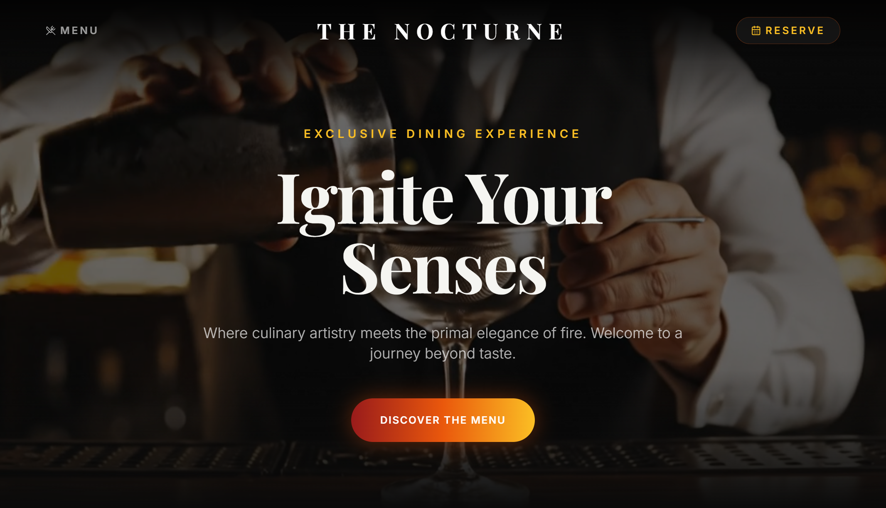
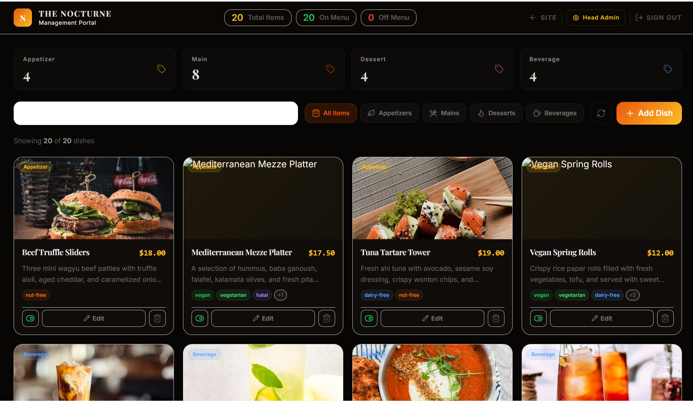
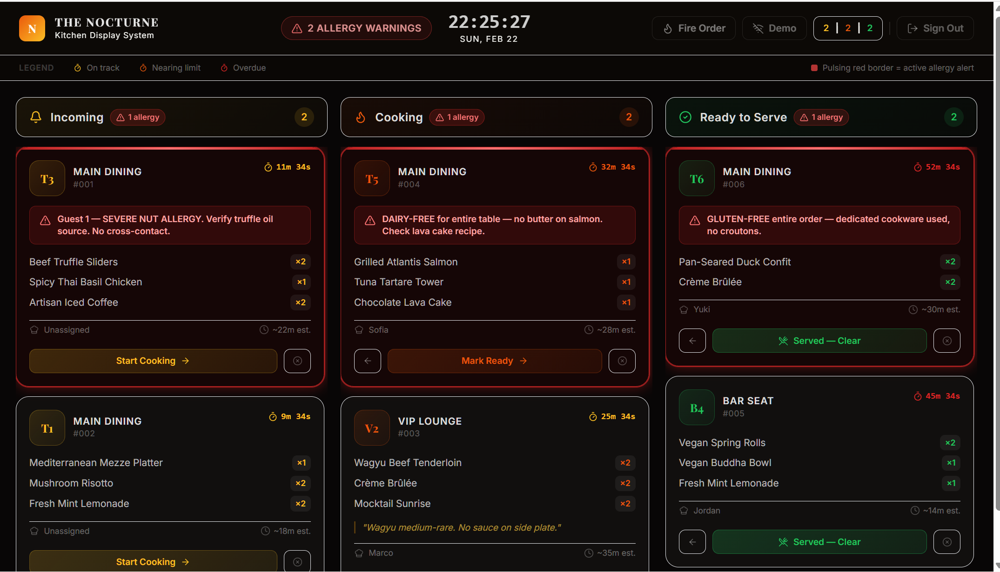

# The Nocturne — Restaurant Management System

A full-stack, role-based Restaurant Management System built as a portfolio project. Covers the complete restaurant workflow from guest-facing menus and reservations through kitchen operations and back-office management — all wired to a live Firebase backend.

---

## Live Demo

> **Guest access** — no login required  
> **Staff access** — use the credentials below

| Role | Email | Password |
|---|---|---|
| Admin | `admin@nocturne.com` | `nocturne2026` |
| Kitchen | `kitchen@nocturne.com` | `nocturne2026` |

---

## Modules

### 🍽️ Module A — Dietary Menu (Guest)
- Browse the full menu by category with live Firestore data
- Search and multi-select dietary filters (vegan, gluten-free, nut-free, etc.)
- Allergen-safe highlighting per item
- Detail modal with ingredients and "Ask your waiter" prompt — intentionally view-only

### 🪑 Module B — Reservations (Guest)
- Interactive 3D dining room rendered with React Three Fiber
- Click any seat to open a booking form
- Seat status reflected in real time (available / reserved)

### 🧑‍🍳 Module C — Kitchen Display System (Staff: Admin / Kitchen)
- Kanban board: Incoming → Cooking → Ready
- Drag-and-drop order progression via dnd-kit
- Toggle between live Firebase orders and a built-in demo mode
- Pulse animation on new/urgent tickets

### ⚙️ Module D — Management Dashboard (Admin only)
- Full CRUD for menu items with image URL support
- Toggle item availability without deleting
- One-click "Seed Demo Data" when the menu collection is empty
- Role-protected — kitchen staff cannot access this page

---

## Tech Stack

| Layer | Technology |
|---|---|
| Framework | React 19 + TypeScript + Vite 7 |
| Styling | TailwindCSS 3.4 (custom brand tokens, dark theme) |
| Animation | Framer Motion 12 |
| 3D | Three.js 0.183 · React Three Fiber 9 · Drei 10 |
| State | Zustand 5 |
| Data Fetching | TanStack React Query 5 |
| Backend | Firebase 12 (Firestore + Auth) |
| Routing | React Router 7 (protected routes, role redirects) |
| UI Primitives | Radix UI (Dialog, Tooltip) · Lucide React |
| Drag & Drop | dnd-kit (core + sortable) |

---

## Project Structure

```
src/
├── components/          # Shared layout & UI (Navigation, MainLayout, BrandedLoader)
├── pages/
│   ├── Landing/         # Public landing page with video backgrounds
│   ├── DietaryMenu/     # Guest menu browser
│   ├── Reservation/     # 3D seat-booking page
│   ├── KitchenDisplay/  # KDS Kanban board
│   ├── Management/      # Admin CRUD dashboard
│   └── Auth/            # Login page
├── services/            # Firebase service layer (auth, menu, order, table, seed)
├── store/               # Zustand global store
├── types/               # Shared TypeScript interfaces
└── utils/               # Utility helpers (cn, etc.)
```

---

## Role-Based Access

```
Guest        →  /  · /dietary-menu · /reservations
Kitchen      →  /kitchen
Admin        →  /kitchen · /management
```

- Unauthenticated users hitting a protected route are redirected to `/login`
- Logged-in users hitting `/login` are redirected to their role's default page
- The "Staff Access" link is tucked in the landing page footer — guests won't stumble on it

---

## Getting Started

### Prerequisites

- Node.js 18+
- A Firebase project with **Firestore** and **Email/Auth** enabled

### Install & run

```bash
git clone https://github.com/MH-Shomik/The-Nocturne-RMS.git
cd The-Nocturne-RMS
npm install
```

Create a `.env` file in the project root:

```env
VITE_FIREBASE_API_KEY=your_api_key
VITE_FIREBASE_AUTH_DOMAIN=your_project.firebaseapp.com
VITE_FIREBASE_PROJECT_ID=your_project_id
VITE_FIREBASE_STORAGE_BUCKET=your_project.appspot.com
VITE_FIREBASE_MESSAGING_SENDER_ID=your_sender_id
VITE_FIREBASE_APP_ID=your_app_id
```

```bash
npm run dev       # development server
npm run build     # production build (tsc + vite)
npm run preview   # preview the production bundle
```

---

## Firebase Setup

1. Enable **Email/Password** authentication in the Firebase console
2. Create a `users` Firestore collection — each document keyed by `uid`:
   ```json
   { "name": "Admin User", "role": "admin", "email": "admin@nocturne.com" }
   ```
3. The app will seed the `menuItems` collection automatically when you log in as admin and the collection is empty (Seed Demo Data button)

**Suggested Firestore rules (for demo):**
```
rules_version = '2';
service cloud.firestore {
  match /databases/{database}/documents {
    match /{document=**} {
      allow read: if true;
      allow write: if request.auth != null;
    }
  }
}
```

---

## Screenshots

### Landing Page


### Management Dashboard


### Kitchen Display System


---

## Author

**MH Shomik** — [GitHub](https://github.com/MH-Shomik)

---

## License

For portfolio and demonstration purposes only.
